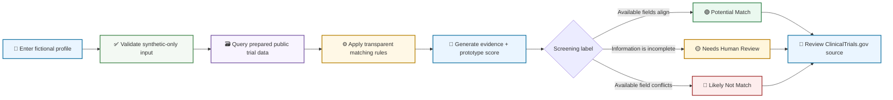
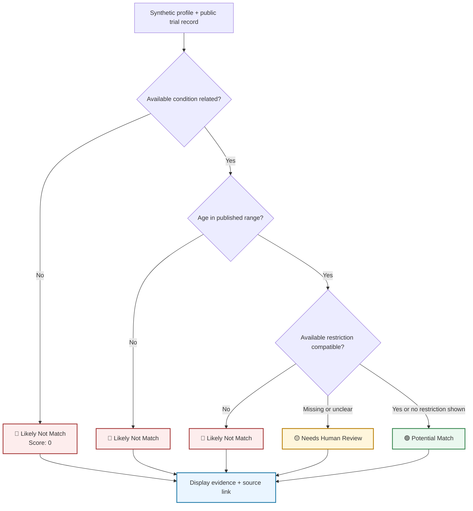
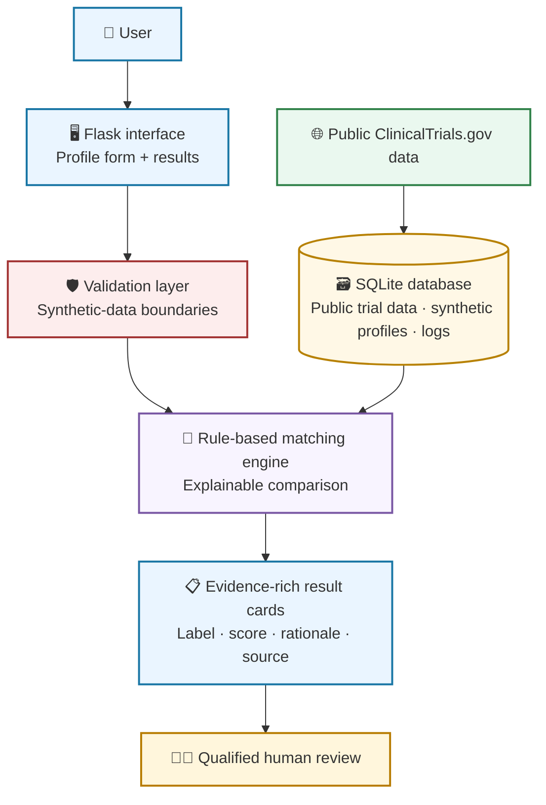

<div align="center">

# 🧭 MediTrial Navigator

### Explainable clinical-trial discovery using synthetic profiles and public study data

<br />

[](https://www.python.org/)
[](https://flask.palletsprojects.com/)
[](https://www.sqlite.org/)
[](https://clinicaltrials.gov/)
[](#safety-and-scope)

<br />

[🚀 Overview](#overview) ·
[🔄 Workflow](#workflow) ·
[🖼️ Screens](#product-screens) ·
[🏗️ Architecture](#architecture) ·
[⚙️ Run Locally](#run-locally) ·
[🛡️ Safety](#safety-and-scope)

</div>

---

> [!IMPORTANT]
> **Educational portfolio prototype only.** MediTrial Navigator works only with fictional/synthetic profiles and selected public ClinicalTrials.gov fields. It does not use real patient data, provide medical advice, diagnose conditions, recommend treatment, or determine actual clinical-trial eligibility. All results require qualified human review.

## Overview

MediTrial Navigator is an explainable Flask and SQLite application that demonstrates a transparent approach to early-stage clinical-trial discovery.

The application accepts a fictional profile, compares selected profile fields against prepared public ClinicalTrials.gov data, and displays evidence-rich results. Rather than claiming that someone is eligible for a study, it categorizes records for further human review and links directly to the original public source.

### Core idea

```text
Fictional profile
      +
Selected public trial fields
      ↓
Transparent rule-based comparison
      ↓
Evidence, prototype score, and review label
      ↓
Qualified human review of the source record
```

## What It Does

<table>
<tr>
<td width="50%">

### 🧪 Uses fictional profiles

The application is designed for synthetic information only. It explicitly warns users not to enter their own or anyone else’s real health information.

</td>
<td width="50%">

### 🔎 Screens public study data

It compares limited available fields, including condition relationship, age range, recruitment status, and sex eligibility when that information is present.

</td>
</tr>
<tr>
<td width="50%">

### 🧠 Explains each result

Every trial card shows a prototype label, a score, and evidence bullets explaining which available facts supported or prevented a match.

</td>
<td width="50%">

### 🔗 Preserves source traceability

Each trial result provides an NCT identifier and a direct link to the public ClinicalTrials.gov record for verification.

</td>
</tr>
</table>

## Workflow



## How It Works

### 1. Submit a fictional profile

The first screen collects limited fields for a synthetic patient profile. The form includes a visible reminder that the app is for fictional data only.

<p align="center">
  
</p>

Example:

```text
Synthetic patient ID: SYN008
Age:                  49
Sex:                  Male
State:                New Jersey
Primary condition:    Type 2 diabetes
Medication summary:   Fictional medication example
HbA1c:                8.2
```

### 2. Compare selected public fields

| Public trial field | Example | Role in the prototype |
|---|---|---|
| Primary condition | Type 2 diabetes | Checks available topic relationship |
| Recruitment status | Recruiting | Shows the status in the public study record |
| Available age range | 18 to 75 | Checks if the fictional age fits the displayed range |
| Sex eligibility | All / Male / Female / Not specified | Identifies an available restriction when present |
| NCT ID | `NCT06688461` | Lets a reviewer find the original study record |

### 3. Apply transparent prototype rules



### 4. Display evidence—not a clinical decision

| Label | Meaning | Does not mean |
|---|---|---|
| 🟢 **Potential Match** | Available public fields support further human review | Confirmed eligibility or enrollment approval |
| 🟡 **Needs Human Review** | Data is incomplete, ambiguous, or requires expert interpretation | Eligible or ineligible |
| 🔴 **Likely Not Match** | An available field conflicts with the fictional profile | A medical diagnosis or final decision |

## Product Screens

### Fictional profile entry

The app starts with a clear synthetic-data-only warning and a structured form for fictional profile fields.

<p align="center">
  
</p>

### Evidence-rich potential matches

Results are displayed as reviewable cards. Each card includes a status label, prototype score, NCT ID, recruitment status, available age range, explanatory evidence, and a source link.

<p align="center">
  
</p>

## Safety Validation

This repository includes a documented non-match safety case for a fictional Type 3 diabetes profile.

In the test output, records with available study conditions that do not match the fictional profile are labeled:

```text
Likely Not Match
Prototype score: 0
Reason: Primary condition does not match the available trial condition.
```

The complete three-page output is stored at:

```text
docs/meditrial-safety-test-likely-not-match.pdf
```

> [!TIP]
> This scenario is important because it shows that the app does not automatically return positive results simply because a study title includes a broad related word such as “diabetes.”

## Architecture



## Technology Stack

| Area | Technology | Purpose |
|---|---|---|
| Application | Python + Flask | Routes, backend processing, and template rendering |
| Database | SQLite | Stores prepared trial data, fictional profiles, results, and logs |
| Data source | ClinicalTrials.gov | Provides public trial information and source records |
| Matching | Python | Executes transparent, deterministic screening rules |
| User interface | HTML, CSS, Jinja templates | Builds the form and results-card experience |
| Testing | Pytest | Validates matching and safety-related behavior |

## Project Structure

```text
agentic-clinical-trial-matching/
│
├── app.py
├── README.md
├── requirements.txt
├── .gitignore
│
├── data_raw/
├── data_processed/
├── database/
├── src/
├── static/
├── templates/
├── tests/
│
├── images/
│   ├── home-profile-selection.jpg
│   └── results-potential-matches.jpg
│
└── docs/
    └── meditrial-safety-test-likely-not-match.pdf
```

## Run Locally

### 1. Clone the repository

```bash
git clone [https://github.com/vivek0717/agentic-clinical-trial-matching.git](https://github.com/vivek0717/agentic-clinical-trial-matching.git)
cd agentic-clinical-trial-matching
```

### 2. Create a virtual environment

```bash
python -m venv .venv
```

**Windows PowerShell**

```powershell
.venv\Scripts\Activate.ps1
```

**macOS / Linux**

```bash
source .venv/bin/activate
```

### 3. Install dependencies

```bash
pip install -r requirements.txt
```

### 4. Start the Flask app

```bash
python app.py
```

Then open:

```text
http://127.0.0.1:5000/
```

> [!NOTE]
> This is a local-only address. It works only on the computer that is running the Flask application. A public website link can be added after deployment.

### 5. Run tests

```bash
pytest
```

## Live Demo

🚧 **Deployment in progress.** The project currently runs locally with Flask.

After deployment, add a public button here:

```md
[
```

## Safety and Scope

> [!WARNING]
> MediTrial Navigator is an educational software and data-product portfolio project, not clinical decision-support software.

- Use fictional or synthetic profiles only.
- Do not enter real patient information, medical records, or personally identifiable information.
- The project does not provide medical advice, diagnoses, treatment recommendations, or definitive eligibility decisions.
- Public trial fields may be incomplete or insufficient to represent full study requirements.
- A **Potential Match** means only that the displayed public fields warrant further review.
- A **Likely Not Match** reflects an available data conflict, not a clinical judgment.
- A **Needs Human Review** result is used when the prototype should not guess.
- Qualified study staff and healthcare professionals make all final eligibility and enrollment decisions.
- Every result should be verified using the linked ClinicalTrials.gov record.

## Test Scenarios

| Scenario | Expected behavior |
|---|---|
| Synthetic adult with a related condition | May show potential matches for human review |
| Synthetic profile with a non-matching condition | Returns **Likely Not Match** |
| Profile missing relevant information | Returns **Needs Human Review** rather than guessing |
| Underage synthetic profile | Displays a validation response |
| Non-synthetic profile identifier | Blocks the input to protect the synthetic-only boundary |

## Future Improvements

- [ ] Add trial-location filtering
- [ ] Add data-refresh timestamps and source provenance
- [ ] Improve structured inclusion/exclusion-criteria handling
- [ ] Expand automated test coverage
- [ ] Add accessibility checks and improvements
- [ ] Add data-quality monitoring
- [ ] Deploy a public, synthetic-data-only demo
- [ ] Add an application walkthrough video or GIF

## Data Attribution

Trial information is derived from public records on [ClinicalTrials.gov](https://clinicaltrials.gov/). This project is not affiliated with, endorsed by, or maintained by ClinicalTrials.gov or the U.S. National Library of Medicine.

## Author

**Vivek Parmar**  
MS in Business Analytics · SQL · Python · Tableau · Data-Driven Storytelling  
GitHub: [@vivek0717](https://github.com/vivek0717)

---

<div align="center">

### Educational healthcare-analytics portfolio prototype

**Transparent rules · Synthetic data only · Human review required**

</div>