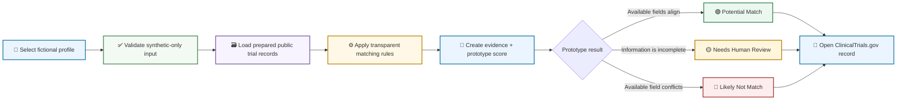
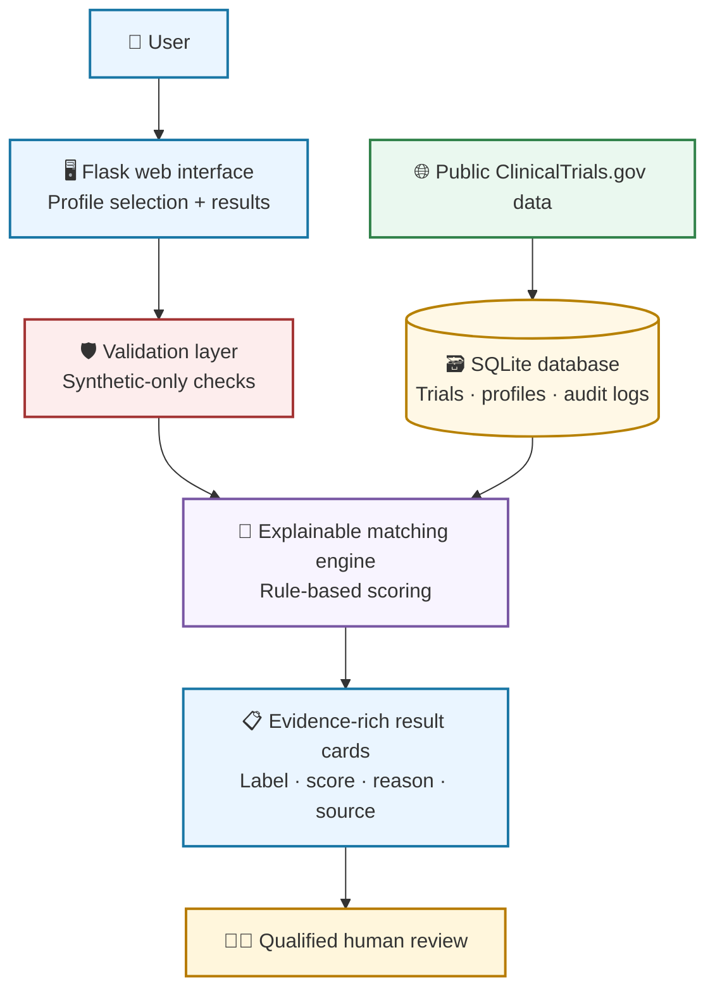

<div align="center">

# 🧭 MediTrial Navigator

### An explainable clinical-trial discovery prototype built with synthetic profiles and public study data

<br />

[](https://www.python.org/)
[](https://flask.palletsprojects.com/)
[](https://www.sqlite.org/)
[](https://clinicaltrials.gov/)
[](#safety--scope)

<br />

[🚀 Demo Flow](#demo-flow) ·
[🧠 How It Works](#how-it-works) ·
[🖥️ Screens](#screens) ·
[⚙️ Run Locally](#run-locally) ·
[🛡️ Safety & Scope](#safety--scope)

</div>

---

> [!IMPORTANT]
> **Educational portfolio prototype only.** MediTrial Navigator uses fictional/synthetic profiles and selected public ClinicalTrials.gov fields. It does not use real patient data, provide medical advice, diagnose conditions, recommend treatment, or determine real clinical-trial eligibility. All results require qualified human review.

## The Challenge

Clinical-trial records contain many fields: conditions, recruitment status, age requirements, sex eligibility, locations, and detailed inclusion/exclusion criteria.

A study title alone cannot determine whether a person can participate. MediTrial Navigator demonstrates how an explainable data application can organize selected public trial fields, compare them with a **synthetic profile**, and clearly show the evidence behind each result.

> **The goal is not to make an eligibility decision.**  
> The goal is to support early-stage trial discovery with transparent evidence and clear human-review boundaries.

## What It Does

<table>
<tr>
<td width="50%">

### 🧪 Uses synthetic profiles

The application works with fictional profiles such as `SYN008`. This protects privacy and makes the project appropriate for safe educational and portfolio use.

</td>
<td width="50%">

### 🔎 Screens public study fields

The matching logic compares available trial information such as condition relationship, age range, recruitment status, and sex eligibility.

</td>
</tr>
<tr>
<td width="50%">

### 🧠 Explains each result

Every trial card includes a prototype score and plain-language evidence explaining why the record was surfaced, rejected, or routed for review.

</td>
<td width="50%">

### 🔗 Preserves traceability

Every displayed trial links directly to its public ClinicalTrials.gov record for human verification.

</td>
</tr>
</table>

## Demo Flow



## How It Works

### 1. Select a fictional profile

The user selects a pre-created synthetic profile. The application is designed not to request, store, or process real patient information.

```text
Example synthetic profile
──────────────────────────────────────
Profile ID: SYN008
Age:        49
Sex:        Male
Condition:  Type 2 diabetes
──────────────────────────────────────
```

### 2. Review available public trial fields

The app uses selected structured fields prepared from public ClinicalTrials.gov records.

| Field | Example displayed | Why it is useful |
|---|---|---|
| Trial condition | Type 2 diabetes | Checks whether the study topic relates to the synthetic profile’s primary condition |
| Recruitment status | Recruiting | Indicates whether the public record lists the study as recruiting |
| Available age range | 18 to 75 | Checks whether the profile falls within the published age range |
| Sex eligibility | All / Male / Female / Not specified | Identifies a possible restriction when public information is available |
| NCT ID | `NCT06688461` | Creates traceability back to the source record |

### 3. Apply transparent rules

The application intentionally uses explainable rule-based logic rather than a black-box model.


### 4. Show evidence, not a clinical decision

| Label | Meaning | Does not mean |
|---|---|---|
| 🟢 **Potential Match** | The visible public fields support additional human review | Confirmed eligibility or enrollment approval |
| 🟡 **Needs Human Review** | The available information is incomplete, uncertain, or requires professional interpretation | Eligibility or ineligibility |
| 🔴 **Likely Not Match** | An available public field conflicts with the synthetic profile | A medical diagnosis or final decision |

## Screens

### Potential trial results

The main results view presents candidate public studies with a clear match label, prototype score, recruitment status, available age range, evidence bullets, and a direct source link.

<p align="center">
  
</p>

### Evidence-rich trial cards

Each result card explains the available evidence used by the prototype. This makes the logic inspectable and helps a reviewer understand why the trial was shown.

<p align="center">
  
</p>

## Safety Validation

A good screening prototype must support safe negative outcomes, not just positive-looking results.

The project includes a Type 3 diabetes **synthetic profile** test case. Because the available study condition fields did not match the profile’s primary condition, the system produced **Likely Not Match** results with a prototype score of 0 and a clear condition-mismatch explanation.

This safety evidence is stored separately as a PDF:

```text
docs/meditrial-safety-test-likely-not-match.pdf
```

> [!TIP]
> This test case demonstrates a critical design principle: the application should not claim someone is a potential fit merely because a trial title contains a related term such as “diabetes.”

## Application Architecture



## Technology Stack

| Area | Technology | Role |
|---|---|---|
| Application | Python + Flask | Web routes, server-side logic, and rendered templates |
| Data storage | SQLite | Stores trial records, synthetic profiles, matching results, and logs |
| Public data | ClinicalTrials.gov | Provides public study information and source records |
| Matching logic | Python | Applies transparent, deterministic prototype rules |
| User interface | HTML, CSS, Jinja | Builds the website and result cards |
| Testing | Pytest | Tests matching behavior and validation rules |

## Project Structure

> Update this folder tree if your real filenames differ.

```text
YOUR-EXISTING-REPOSITORY-NAME/
│
├── app.py
├── matching.py
├── database.py
├── requirements.txt
├── README.md
│
├── data/
│   └── trials.db
│
├── templates/
│   ├── base.html
│   ├── index.html
│   ├── results.html
│   └── about.html
│
├── static/
│   └── styles.css
│
├── images/
│   ├── results-potential-matches.jpg
│   └── results-match-cards.jpg
│
├── docs/
│   └── meditrial-safety-test-likely-not-match.pdf
│
└── tests/
    └── test_matching.py
```

## Run Locally

### 1. Clone the repository

```bash
git clone [https://github.com/YOUR-GITHUB-USERNAME/YOUR-EXISTING-REPOSITORY-NAME.git](https://github.com/YOUR-GITHUB-USERNAME/YOUR-EXISTING-REPOSITORY-NAME.git)
cd YOUR-EXISTING-REPOSITORY-NAME
```

### 2. Create and activate a virtual environment

```bash
python -m venv .venv
```

**Windows PowerShell**

```powershell
.venv\Scripts\Activate.ps1
```

**macOS / Linux**

```bash
source .venv/bin/activate
```

### 3. Install project dependencies

```bash
pip install -r requirements.txt
```

### 4. Run the Flask application

```bash
flask --app app run
```

Visit the local application:

```text
http://127.0.0.1:5000
```

### 5. Run tests

```bash
pytest
```

## Safety & Scope

> [!WARNING]
> MediTrial Navigator is a data and software portfolio demonstration, not clinical decision-support software.

- Use only fictional or synthetic profile data.
- Do not enter real patient information, medical records, or personally identifiable information.
- The application does not provide medical advice, diagnosis, treatment recommendations, or definitive eligibility decisions.
- Public trial fields can be incomplete, outdated, or insufficient to evaluate full study criteria.
- A **Potential Match** indicates only that the displayed public fields support human review.
- A **Likely Not Match** reflects the available public-field comparison and is not a medical determination.
- A **Needs Human Review** label is used when the project should not guess.
- Final eligibility and enrollment decisions must be made by qualified study staff and healthcare professionals.
- Every result should be verified through the linked ClinicalTrials.gov record.

## Test Scenarios

| Scenario | Expected behavior |
|---|---|
| Synthetic adult profile with a related condition | May show potential matches for human review |
| Synthetic profile with a non-matching condition | Returns **Likely Not Match** |
| Profile with missing relevant detail | Returns **Needs Human Review** rather than guessing |
| Underage synthetic profile | Displays a validation response |
| Non-synthetic ID | Blocks the input to preserve the synthetic-data-only boundary |

## Future Improvements

- [ ] Add study-location filtering
- [ ] Add public-data refresh timestamps and provenance tracking
- [ ] Improve handling of structured inclusion and exclusion criteria
- [ ] Expand unit and integration-test coverage
- [ ] Add accessibility testing and WCAG improvements
- [ ] Add data-quality metrics and monitoring
- [ ] Deploy a synthetic-data-only demonstration version
- [ ] Add a product walkthrough video or animated GIF

## Data Attribution

Study information is derived from public records on [ClinicalTrials.gov](https://clinicaltrials.gov/). This portfolio project is not affiliated with, endorsed by, or maintained by ClinicalTrials.gov or the U.S. National Library of Medicine.

## Author

**Vivek Parmar**  
MS in Business Analytics · SQL · Python · Tableau · Data-Driven Storytelling  
GitHub: [@vivek0717](https://github.com/vivek0717)

---

<div align="center">

### Built as an educational healthcare-analytics portfolio project

**Transparent rules · Synthetic data only · Human review required**

</div>