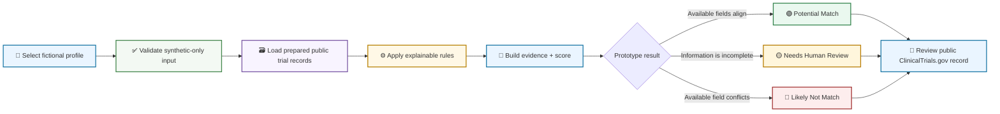
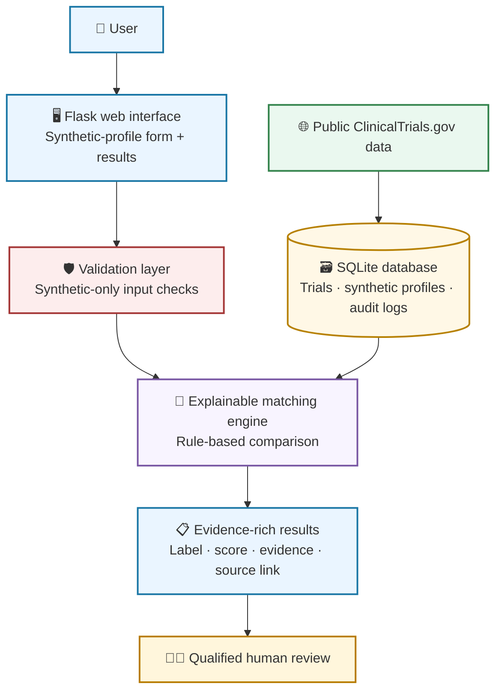

<div align="center">

# 🧭 MediTrial Navigator

### An explainable clinical-trial discovery prototype built with synthetic profiles and public study data

<br />

[](https://www.python.org/)
[](https://flask.palletsprojects.com/)
[](https://www.sqlite.org/)
[](https://clinicaltrials.gov/)
[](#safety--scope)

<br />

[🚀 Start Here](#start-here) ·
[🧠 How It Works](#how-it-works) ·
[🖥️ Product Screens](#product-screens) ·
[🏗️ Architecture](#application-architecture) ·
[⚙️ Run Locally](#run-locally) ·
[🛡️ Safety](#safety--scope)

</div>

---

> [!IMPORTANT]
> **Educational portfolio prototype only.** MediTrial Navigator uses fictional/synthetic profiles and selected public ClinicalTrials.gov fields. It does not use real patient data, provide medical advice, diagnose conditions, recommend treatment, or determine actual clinical-trial eligibility. Every result requires qualified human review.

## Start Here

MediTrial Navigator is an explainable Flask + SQLite prototype that demonstrates how public clinical-trial information can be organized for **early-stage discovery**.

The application accepts a **fictional profile** and compares it with selected public study fields, including:

- Trial condition
- Recruitment status
- Available age range
- Available sex requirement
- Source trial identifier, also called an NCT ID

Instead of providing an unsupported clinical conclusion, the system generates a transparent prototype label, explains the evidence it used, and links the reviewer to the public ClinicalTrials.gov study record.

### What problem does it address?

Clinical-trial information can be difficult to review quickly because each public record can contain many different fields, requirements, and details. A trial title alone cannot establish whether someone can take part.

This project demonstrates a safer approach:

```text
Public trial fields + fictional profile
                ↓
Transparent, rule-based comparison
                ↓
Evidence-rich result for human review
                ↓
Public source record for verification
```

> **Important:** The project does not decide whether a person is eligible. It supports preliminary discovery and human review only.

## Demo Flow



## What It Does

<table>
<tr>
<td width="50%">

### 🧪 Synthetic-data design

The application uses fictional profiles only. It is intentionally designed not to request, store, or process real patient information.

</td>
<td width="50%">

### 🔎 Public trial discovery

The application displays selected fields prepared from public ClinicalTrials.gov study records.

</td>
</tr>
<tr>
<td width="50%">

### 🧠 Explainable prototype results

Each result includes a label, prototype score, and plain-language evidence so the screening logic is visible.

</td>
<td width="50%">

### 🔗 Source traceability

Every result links to its public ClinicalTrials.gov record so a reviewer can verify the original source information.

</td>
</tr>
</table>

## How It Works

### 1. Enter a fictional profile

The first screen accepts a fictional profile with selected, limited fields. The interface includes an explicit synthetic-data warning and gives examples of acceptable fictional values.

<p align="center">
  
</p>

Example fictional profile:

```text
Synthetic patient ID: SYN008
Age:                  49
Sex:                  Male
State:                New Jersey
Primary condition:    Type 2 diabetes
Medication summary:   Example fictional medication only
HbA1c:                8.2
```

### 2. Review selected public fields

The matching logic compares the fictional profile with selected fields from public trial records.

| Field | Example displayed by the app | Purpose |
|---|---|---|
| Primary condition | Type 2 diabetes | Checks whether the public trial topic relates to the fictional profile |
| Recruitment status | Recruiting | Shows the status available in the public record |
| Available age range | 18 to 75 | Checks whether the profile age fits the published range |
| Sex eligibility | All / Male / Female / Not specified | Identifies an available restriction, when present |
| NCT ID | `NCT06688461` | Connects a result to its original public trial record |

### 3. Use transparent rules

MediTrial Navigator intentionally uses explainable rule-based logic rather than an opaque prediction model.


### 4. Explain the result

The app shows evidence rather than making a clinical decision.

| Prototype label | What it means | What it does **not** mean |
|---|---|---|
| 🟢 **Potential Match** | Available public fields support further human review | Confirmed eligibility or enrollment approval |
| 🟡 **Needs Human Review** | Available information is missing, unclear, or needs qualified interpretation | Eligible or ineligible |
| 🔴 **Likely Not Match** | An available public field conflicts with the synthetic profile | A medical diagnosis or final eligibility decision |

## Product Screens

### Potential trial matches

The results screen displays trial cards with a visible prototype label, score, NCT ID, recruitment status, age range, evidence bullets, and a direct link to the public ClinicalTrials.gov record.

<p align="center">
  
</p>

### Why evidence matters

A score alone is not enough. Each card explains the available factors that supported the result:

```text
✓ The available condition is related to the profile condition.
✓ The profile age is within the published trial age range.
✓ No restrictive sex requirement is available in the record.
✓ The full eligibility criteria require qualified human review.
```

This approach makes it possible for a reviewer to understand the source of the result before opening the original study record.

## Safety Validation

A trustworthy screening prototype must show appropriate **non-match** behavior, not only positive-looking results.

This project includes a safety-case test using a fictional Type 3 diabetes profile. The public trials shown in the test have available condition fields that do not match the synthetic profile’s primary condition. The app therefore produces:

```text
Result label:     Likely Not Match
Prototype score:  0
Reason:           Primary condition does not match the available trial condition.
```

The full three-page safety validation output is included in this repository:

```text
docs/meditrial-safety-test-likely-not-match.pdf
```

> [!TIP]
> This demonstrates an important product safeguard: a study should not be surfaced as a potential match merely because its title includes a broad related term such as “diabetes.”

## Application Architecture



## Technology Stack

| Area | Technology | Purpose |
|---|---|---|
| Web application | Python + Flask | Routes, server-side processing, and HTML rendering |
| Data storage | SQLite | Stores prepared trials, synthetic profiles, results, and audit information |
| Data source | ClinicalTrials.gov | Provides public study information and source records |
| Matching logic | Python | Applies deterministic, explainable screening rules |
| Interface | HTML, CSS, Jinja templates | Creates the profile form and evidence-rich results cards |
| Testing | Pytest | Supports validation and matching-rule testing |

## Project Structure

```text
agentic-clinical-trial-matching/
│
├── app.py
├── README.md
├── requirements.txt
├── .gitignore
│
├── data_raw/
├── data_processed/
├── database/
├── notebooks/
├── src/
├── static/
├── templates/
├── tests/
│
├── images/
│   ├── home-profile-selection.jpg
│   └── results-potential-matches.jpg
│
└── docs/
    └── meditrial-safety-test-likely-not-match.pdf
```

## Run Locally

### 1. Clone the repository

```bash
git clone [https://github.com/vivek0717/agentic-clinical-trial-matching.git](https://github.com/vivek0717/agentic-clinical-trial-matching.git)
cd agentic-clinical-trial-matching
```

### 2. Create a virtual environment

```bash
python -m venv .venv
```

**Windows PowerShell**

```powershell
.venv\Scripts\Activate.ps1
```

**macOS / Linux**

```bash
source .venv/bin/activate
```

### 3. Install dependencies

```bash
pip install -r requirements.txt
```

### 4. Run the application

```bash
python app.py
```

Then open this address in your browser:

```text
http://127.0.0.1:5000/
```

> [!NOTE]
> `127.0.0.1` is a local address. It works only on the computer running the Flask application. A public live-demo URL will be added after deployment.

### 5. Run tests

```bash
pytest
```

## Live Demo

🚧 **Deployment is in progress.** The prototype currently runs locally with Flask.

When the app is deployed, this section will include a public demo button like this:

```md
[
```

## Safety & Scope

> [!WARNING]
> MediTrial Navigator is an educational data-product and software portfolio demonstration. It is not clinical decision-support software.

- Use only fictional or synthetic profile data.
- Do not enter real patient information, medical records, or personally identifiable information.
- The application does not provide medical advice, medical diagnosis, treatment recommendations, or final eligibility decisions.
- Public trial fields may be incomplete, out of date, or insufficient to assess the full study protocol.
- A **Potential Match** only indicates that the displayed public fields support additional human review.
- A **Likely Not Match** reflects an available-field conflict and is not a clinical judgment.
- A **Needs Human Review** label is used when the prototype should not guess.
- Final eligibility and enrollment decisions must be made by qualified study staff and healthcare professionals.
- Each trial should be verified through the linked ClinicalTrials.gov public record.

## Test Scenarios

| Scenario | Expected system behavior |
|---|---|
| Synthetic adult profile with a related condition | May show potential matches for qualified human review |
| Synthetic profile with a non-matching condition | Returns **Likely Not Match** |
| Synthetic profile with missing relevant information | Returns **Needs Human Review** instead of guessing |
| Underage synthetic profile | Shows a validation response |
| Non-synthetic profile identifier | Blocks the input to preserve the synthetic-data-only boundary |

## Future Improvements

- [ ] Add trial-location filtering
- [ ] Add public-data refresh timestamps and provenance tracking
- [ ] Improve structured handling of inclusion and exclusion criteria
- [ ] Expand unit and integration-test coverage
- [ ] Add accessibility and WCAG-focused testing
- [ ] Add data-quality monitoring metrics
- [ ] Deploy a public synthetic-data-only demo
- [ ] Add a short walkthrough video or animated product demo

## Data Attribution

Study information is derived from public records on [ClinicalTrials.gov](https://clinicaltrials.gov/). This portfolio project is not affiliated with, endorsed by, or maintained by ClinicalTrials.gov or the U.S. National Library of Medicine.

## Author

**Vivek Parmar**  
MS in Business Analytics · SQL · Python · Tableau · Data-Driven Storytelling  
GitHub: [@vivek0717](https://github.com/vivek0717)

---

<div align="center">

### Built as an educational healthcare-analytics portfolio project

**Transparent rules · Synthetic data only · Human review required**

</div>