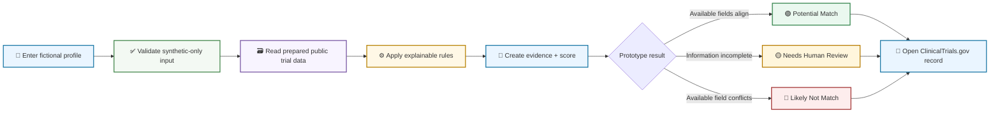
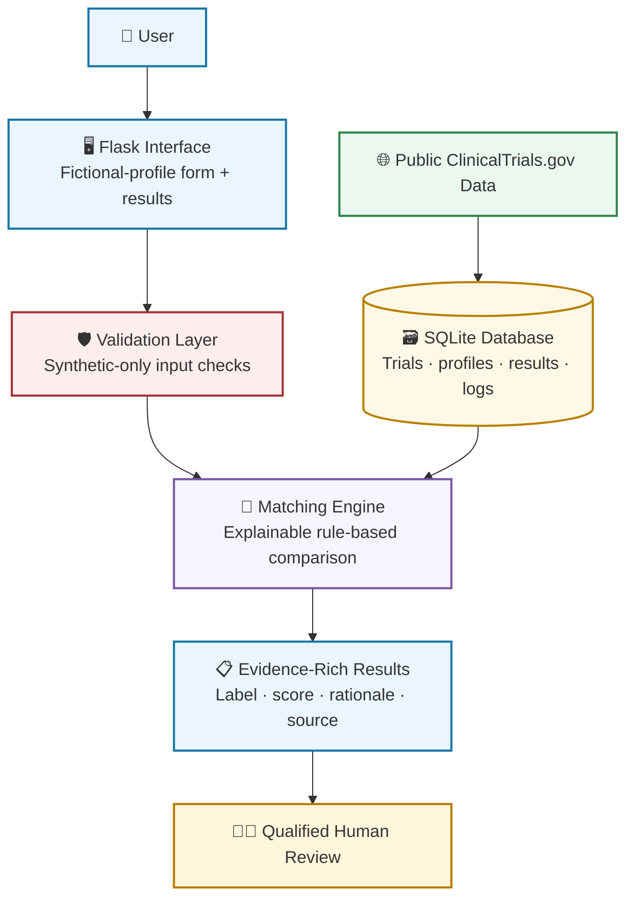

<div align="center">

# 🧭 MediTrial Navigator

### Explainable clinical-trial discovery with fictional profiles and public ClinicalTrials.gov data

<br />

[](https://www.python.org/)
[](https://flask.palletsprojects.com/)
[](https://www.sqlite.org/)
[](https://clinicaltrials.gov/)
[](#safety-and-scope)

<br />

[✨ Overview](#overview) ·
[🔄 Workflow](#workflow) ·
[🖼️ Screens](#product-screens) ·
[🧠 Matching Logic](#matching-logic) ·
[🏗️ Architecture](#architecture) ·
[⚙️ Run Locally](#run-locally) ·
[🛡️ Safety](#safety-and-scope)

</div>

---

> [!IMPORTANT]
> **Educational portfolio prototype only.** MediTrial Navigator uses fictional/synthetic profile data and selected public ClinicalTrials.gov fields. It does not use real patient information, provide medical advice, diagnose medical conditions, recommend treatment, or determine actual clinical-trial eligibility. Every result requires qualified human review.

## Overview

MediTrial Navigator is an explainable Flask and SQLite prototype for **early-stage clinical-trial discovery**.

The application accepts a fictional patient profile, compares it against selected public trial fields, and returns evidence-rich results. Rather than making a clinical decision, it helps a reviewer understand which public study records may warrant further investigation.

```text
Fictional profile
       +
Selected public trial fields
       ↓
Transparent rule-based comparison
       ↓
Prototype score + evidence + review label
       ↓
Qualified human review of the original source record
```

### Why this matters

Clinical-trial records can include many fields: study conditions, recruitment status, age requirements, sex eligibility, location information, and detailed inclusion/exclusion criteria.

A study title alone cannot prove that someone qualifies for a trial. MediTrial Navigator demonstrates a safer data-product pattern:

- Use limited public fields.
- Make the comparison logic visible.
- Show the evidence behind each result.
- Never describe a prototype match as confirmed eligibility.
- Direct the reviewer to the original ClinicalTrials.gov record.

## Key Features

<table>
<tr>
<td width="50%">

### 🧪 Synthetic-data-only workflow

The application is intentionally designed for fictional profiles. The form tells users not to enter their own or anyone else’s real health information.

</td>
<td width="50%">

### 🔎 Public trial discovery

The app uses selected prepared fields from public ClinicalTrials.gov records, including condition, recruitment status, age range, and available sex eligibility.

</td>
</tr>
<tr>
<td width="50%">

### 🧠 Explainable matching

Each result includes a visible prototype label, score, and evidence bullets. The logic is transparent rather than hidden inside a black-box model.

</td>
<td width="50%">

### 🔗 Source traceability

Every result includes an NCT ID and a direct link to the public ClinicalTrials.gov record for verification.

</td>
</tr>
<tr>
<td width="50%">

### 🛡️ Safety boundaries

The application includes synthetic-only validation, human-review language, and non-match behavior to prevent unsupported eligibility claims.

</td>
<td width="50%">

### 🧾 Audit-ready design

The project structure supports retaining result and screening information for prototype traceability and review.

</td>
</tr>
</table>

## Workflow



## Product Screens

### 1. Fictional profile screening

The application starts with a structured form for a fictional profile. It includes a clear synthetic-data-only warning and captures selected values used by the prototype workflow.

<p align="center">
  
</p>

### Example fictional profile

```text
Synthetic Patient ID: SYN008
Age:                  49
Sex:                  Male
State:                New Jersey
Primary Condition:    Type 2 diabetes
Medication Summary:   Fictional medication example
HbA1c:                8.2
```

> [!NOTE]
> The values above are fictional examples for the educational prototype. They are not real patient data.

### 2. Evidence-rich potential matches

The results page displays potential studies as reviewable cards. Each card contains a prototype label, score, NCT ID, recruitment status, available age range, explanation bullets, and a link to the source record.

<p align="center">
  
</p>

### What a reviewer can see

```text
🟢 Potential Match
Prototype score: 80

✓ Available condition is related to the profile condition.
✓ Profile age is within the available trial age range.
✓ No restrictive sex requirement is available in the public record.
✓ Final eligibility requires qualified human review.

→ View public ClinicalTrials.gov record
```

## Matching Logic

MediTrial Navigator uses transparent rules rather than a hidden prediction model.


### Result labels

| Label | Meaning | It does **not** mean |
|---|---|---|
| 🟢 **Potential Match** | Available public fields support additional human review | Confirmed eligibility or approval to enroll |
| 🟡 **Needs Human Review** | Information is missing, ambiguous, or needs qualified interpretation | The profile is eligible or ineligible |
| 🔴 **Likely Not Match** | An available public field conflicts with the fictional profile | A medical diagnosis or final trial decision |

## Safety Validation

A trustworthy prototype must show appropriate **non-match behavior**—not only positive-looking results.

This repository includes a safety-case test using a fictional Type 3 diabetes profile. The public trial records shown in the test had available conditions that did not match the synthetic profile’s primary condition.

The expected result was:

```text
Result label:     Likely Not Match
Prototype score:  0
Evidence:         Primary condition does not match the available trial condition.
```

The complete three-page safety test is available in this repository:

```text
docs/meditrial-safety-test-likely-not-match.pdf
```

> [!TIP]
> This test demonstrates an important safeguard: a study should not be called a potential match simply because its title includes a broad word such as “diabetes.”

## Architecture



## Technology Stack

| Area | Technology | Purpose |
|---|---|---|
| Backend | Python + Flask | Web routes, server-side processing, and template rendering |
| Database | SQLite | Stores prepared study records, synthetic profiles, results, and logs |
| Public data | ClinicalTrials.gov | Provides public trial information and source records |
| Matching logic | Python | Applies deterministic, explainable screening rules |
| Frontend | HTML, CSS, Jinja templates | Creates the profile form and interactive result cards |
| Testing | Pytest | Supports rule and validation testing |

## Project Structure

```text
agentic-clinical-trial-matching/
│
├── app.py
├── README.md
├── requirements.txt
├── .gitignore
│
├── data_raw/
├── data_processed/
├── database/
├── src/
├── static/
├── templates/
├── tests/
│
├── images/
│   ├── home-profile-selection.jpg
│   └── results-potential-matches.jpg
│
└── docs/
    └── meditrial-safety-test-likely-not-match.pdf
```

## Run Locally

### 1. Clone the repository

```bash
git clone [https://github.com/vivek0717/agentic-clinical-trial-matching.git](https://github.com/vivek0717/agentic-clinical-trial-matching.git)
cd agentic-clinical-trial-matching
```

### 2. Create a virtual environment

```bash
python -m venv .venv
```

**Windows PowerShell**

```powershell
.venv\Scripts\Activate.ps1
```

**macOS / Linux**

```bash
source .venv/bin/activate
```

### 3. Install dependencies

```bash
pip install -r requirements.txt
```

### 4. Start the Flask application

```bash
python app.py
```

Open the local application:

```text
http://127.0.0.1:5000/
```

> [!NOTE]
> `127.0.0.1` is a local-only address. It works only on the computer currently running the Flask server. A shareable public website link will be added after deployment.

### 5. Run tests

```bash
pytest
```

## Live Demo

🚧 **Deployment in progress.**

The app currently runs locally with Flask. After deployment, add a public website button here:

```md
[
```

## Safety and Scope

> [!WARNING]
> MediTrial Navigator is an educational data-product and software portfolio demonstration. It is not clinical decision-support software.

- Use fictional or synthetic profiles only.
- Do not enter real patient information, medical records, or personally identifiable information.
- The project does not provide medical advice, diagnosis, treatment recommendations, or final eligibility decisions.
- Public study fields may be incomplete, outdated, or insufficient to represent the complete trial protocol.
- A **Potential Match** only means the displayed public fields support additional qualified review.
- A **Likely Not Match** reflects an available-field conflict and is not a medical judgment.
- A **Needs Human Review** result is used when the prototype should not guess.
- Final eligibility and enrollment decisions belong to qualified study staff and healthcare professionals.
- Every result should be verified using the linked ClinicalTrials.gov record.

## Test Scenarios

| Scenario | Expected behavior |
|---|---|
| Synthetic adult profile with a related condition | May show potential matches for human review |
| Synthetic profile with a non-matching condition | Returns **Likely Not Match** |
| Profile with missing relevant information | Returns **Needs Human Review** rather than guessing |
| Underage synthetic profile | Displays a validation response |
| Non-synthetic profile ID | Blocks input to preserve the synthetic-data-only boundary |

## Future Improvements

- [ ] Add study-location filtering
- [ ] Add public-data refresh timestamps and source provenance
- [ ] Improve structured handling of inclusion and exclusion criteria
- [ ] Expand unit and integration testing
- [ ] Add accessibility testing and WCAG improvements
- [ ] Add data-quality monitoring
- [ ] Deploy a public synthetic-data-only demo
- [ ] Add a short walkthrough video or animated GIF

## Data Attribution

Trial information is derived from public records on [ClinicalTrials.gov](https://clinicaltrials.gov/). This portfolio project is not affiliated with, endorsed by, or maintained by ClinicalTrials.gov or the U.S. National Library of Medicine.

## Author

**Vivek Parmar**  
MS in Business Analytics · SQL · Python · Tableau · Data-Driven Storytelling  
GitHub: [@vivek0717](https://github.com/vivek0717)

---

<div align="center">

### Educational healthcare-analytics portfolio prototype

**Transparent rules · Synthetic data only · Human review required**

</div>